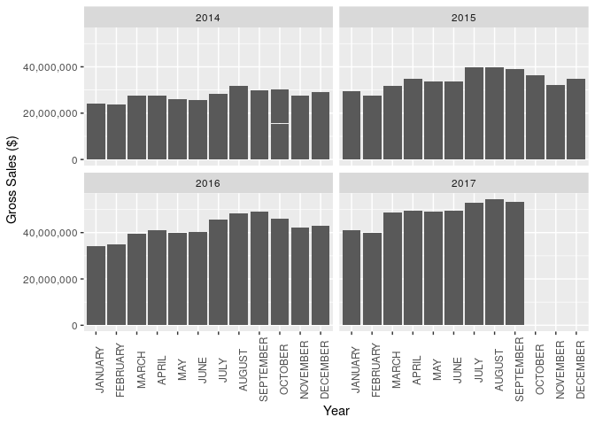

<!-- README.md is generated from README.Rmd. Please edit that file -->

<!-- You'll still need to render `README.Rmd` regularly, to keep `README.md` up-to-date. `devtools::build_readme()` is handy for this.  -->

# Insert Package Name

<!-- badges: start -->

<!-- badges: end -->

The goal of XXX is to …

## Installation

The development version of XXX is available from
[GitHub](https://github.com/) with:

## About the data

The Data were collected and made available by the City of Denver Open
Data Catalog

It contains the dataset `weed`, which contains 4 variables and 90
observations, as well as the dataset `weed_wider`, a pivoted, untidy
version of `weed` which may be useful for certain graphs

``` r
library(pkgGrpm)

head(weed)
#>   YEAR     MONTH          GROSS_SALES_TYPE GROSS_SALES
#> 1 2017 SEPTEMBER Medical Total Gross Sales    18314027
#> 2 2017 SEPTEMBER  Retail Total Gross Sales    34950895
#> 3 2017    AUGUST Medical Total Gross Sales    19043315
#> 4 2017    AUGUST  Retail Total Gross Sales    35240979
#> 5 2017      JULY  Retail Total Gross Sales    34815762
#> 6 2017      JULY Medical Total Gross Sales    17922959
head(weed_wider)
#>   YEAR     MONTH Medical Total Gross Sales Retail Total Gross Sales
#> 1 2017 SEPTEMBER                  18314027                 34950895
#> 2 2017    AUGUST                  19043315                 35240979
#> 3 2017      JULY                  17922959                 34815762
#> 4 2017      JUNE                  17615041                 31908811
#> 5 2017       MAY                  18276904                 30671594
#> 6 2017     APRIL                  19070685                 30302993

weed
#>    YEAR     MONTH          GROSS_SALES_TYPE GROSS_SALES
#> 1  2017 SEPTEMBER Medical Total Gross Sales    18314027
#> 2  2017 SEPTEMBER  Retail Total Gross Sales    34950895
#> 3  2017    AUGUST Medical Total Gross Sales    19043315
#> 4  2017    AUGUST  Retail Total Gross Sales    35240979
#> 5  2017      JULY  Retail Total Gross Sales    34815762
#> 6  2017      JULY Medical Total Gross Sales    17922959
#> 7  2017      JUNE Medical Total Gross Sales    17615041
#> 8  2017      JUNE  Retail Total Gross Sales    31908811
#> 9  2017       MAY  Retail Total Gross Sales    30671594
#> 10 2017       MAY Medical Total Gross Sales    18276904
#> 11 2017     APRIL  Retail Total Gross Sales    30302993
#> 12 2017     APRIL Medical Total Gross Sales    19070685
#> 13 2017     MARCH Medical Total Gross Sales    18130411
#> 14 2017     MARCH  Retail Total Gross Sales    30670923
#> 15 2017  FEBRUARY Medical Total Gross Sales    14533973
#> 16 2017  FEBRUARY  Retail Total Gross Sales    25352587
#> 17 2017   JANUARY  Retail Total Gross Sales    25754881
#> 18 2017   JANUARY Medical Total Gross Sales    15455178
#> 19 2016  DECEMBER Medical Total Gross Sales    15609014
#> 20 2016  DECEMBER  Retail Total Gross Sales    27363748
#> 21 2016  NOVEMBER Medical Total Gross Sales    16058904
#> 22 2016  NOVEMBER  Retail Total Gross Sales    26068811
#> 23 2016   OCTOBER Medical Total Gross Sales    17512082
#> 24 2016   OCTOBER  Retail Total Gross Sales    28558294
#> 25 2016 SEPTEMBER  Retail Total Gross Sales    29369231
#> 26 2016 SEPTEMBER Medical Total Gross Sales    19501151
#> 27 2016    AUGUST Medical Total Gross Sales    20509342
#> 28 2016    AUGUST  Retail Total Gross Sales    27735203
#> 29 2016      JULY  Retail Total Gross Sales    26004154
#> 30 2016      JULY Medical Total Gross Sales    19797315
#> 31 2016      JUNE  Retail Total Gross Sales    18451945
#> 32 2016      JUNE Medical Total Gross Sales    21808308
#> 33 2016       MAY Medical Total Gross Sales    18139726
#> 34 2016       MAY  Retail Total Gross Sales    21767245
#> 35 2016     APRIL Medical Total Gross Sales    18241534
#> 36 2016     APRIL  Retail Total Gross Sales    22636825
#> 37 2016     MARCH Medical Total Gross Sales    17858438
#> 38 2016     MARCH  Retail Total Gross Sales    21640895
#> 39 2016  FEBRUARY Medical Total Gross Sales    15881096
#> 40 2016  FEBRUARY  Retail Total Gross Sales    19168168
#> 41 2016   JANUARY Medical Total Gross Sales    15119507
#> 42 2016   JANUARY  Retail Total Gross Sales    19049189
#> 43 2015  DECEMBER  Retail Total Gross Sales    19386601
#> 44 2015  DECEMBER Medical Total Gross Sales    15351918
#> 45 2015  NOVEMBER Medical Total Gross Sales    14234904
#> 46 2015  NOVEMBER  Retail Total Gross Sales    17897720
#> 47 2015   OCTOBER  Retail Total Gross Sales    19100462
#> 48 2015   OCTOBER Medical Total Gross Sales    17121397
#> 49 2015 SEPTEMBER  Retail Total Gross Sales    20766182
#> 50 2015 SEPTEMBER Medical Total Gross Sales    18283836
#> 51 2015    AUGUST Medical Total Gross Sales    19030712
#> 52 2015    AUGUST  Retail Total Gross Sales    20677944
#> 53 2015      JULY  Retail Total Gross Sales    19832895
#> 54 2015      JULY Medical Total Gross Sales    20108192
#> 55 2015      JUNE Medical Total Gross Sales    15889534
#> 56 2015      JUNE  Retail Total Gross Sales    17826867
#> 57 2015       MAY Medical Total Gross Sales    15290603
#> 58 2015       MAY  Retail Total Gross Sales    18324210
#> 59 2015     APRIL  Retail Total Gross Sales    19230573
#> 60 2015     APRIL Medical Total Gross Sales    15580904
#> 61 2015     MARCH  Retail Total Gross Sales    16893566
#> 62 2015     MARCH Medical Total Gross Sales    14906438
#> 63 2015  FEBRUARY Medical Total Gross Sales    13453945
#> 64 2015  FEBRUARY  Retail Total Gross Sales    14268308
#> 65 2015   JANUARY  Retail Total Gross Sales    15314378
#> 66 2015   JANUARY Medical Total Gross Sales    13976219
#> 67 2014  DECEMBER  Retail Total Gross Sales    14423581
#> 68 2014  DECEMBER Medical Total Gross Sales    14854530
#> 69 2014  NOVEMBER  Retail Total Gross Sales    13294944
#> 70 2014  NOVEMBER Medical Total Gross Sales    14324116
#> 71 2014   OCTOBER Medical Total Gross Sales    15528619
#> 72 2014   OCTOBER  Retail Total Gross Sales    14561826
#> 73 2014 SEPTEMBER Medical Total Gross Sales    15877735
#> 74 2014 SEPTEMBER  Retail Total Gross Sales    14017191
#> 75 2014    AUGUST Medical Total Gross Sales    16219530
#> 76 2014    AUGUST  Retail Total Gross Sales    15714663
#> 77 2014      JULY  Retail Total Gross Sales    14176194
#> 78 2014      JULY Medical Total Gross Sales    14165442
#> 79 2014      JUNE Medical Total Gross Sales    13644945
#> 80 2014      JUNE  Retail Total Gross Sales    12146251
#> 81 2014       MAY  Retail Total Gross Sales    11028848
#> 82 2014       MAY Medical Total Gross Sales    15075331
#> 83 2014     APRIL  Retail Total Gross Sales    12002514
#> 84 2014     APRIL Medical Total Gross Sales    15673149
#> 85 2014     MARCH  Retail Total Gross Sales    10893525
#> 86 2014     MARCH Medical Total Gross Sales    16537956
#> 87 2014  FEBRUARY Medical Total Gross Sales    15021878
#> 88 2014  FEBRUARY  Retail Total Gross Sales     8591699
#> 89 2014   JANUARY Medical Total Gross Sales    15462182
#> 90 2014   JANUARY  Retail Total Gross Sales     8490577
weed_wider
#>    YEAR     MONTH Medical Total Gross Sales Retail Total Gross Sales
#> 1  2017 SEPTEMBER                  18314027                 34950895
#> 2  2017    AUGUST                  19043315                 35240979
#> 3  2017      JULY                  17922959                 34815762
#> 4  2017      JUNE                  17615041                 31908811
#> 5  2017       MAY                  18276904                 30671594
#> 6  2017     APRIL                  19070685                 30302993
#> 7  2017     MARCH                  18130411                 30670923
#> 8  2017  FEBRUARY                  14533973                 25352587
#> 9  2017   JANUARY                  15455178                 25754881
#> 10 2016  DECEMBER                  15609014                 27363748
#> 11 2016  NOVEMBER                  16058904                 26068811
#> 12 2016   OCTOBER                  17512082                 28558294
#> 13 2016 SEPTEMBER                  19501151                 29369231
#> 14 2016    AUGUST                  20509342                 27735203
#> 15 2016      JULY                  19797315                 26004154
#> 16 2016      JUNE                  21808308                 18451945
#> 17 2016       MAY                  18139726                 21767245
#> 18 2016     APRIL                  18241534                 22636825
#> 19 2016     MARCH                  17858438                 21640895
#> 20 2016  FEBRUARY                  15881096                 19168168
#> 21 2016   JANUARY                  15119507                 19049189
#> 22 2015  DECEMBER                  15351918                 19386601
#> 23 2015  NOVEMBER                  14234904                 17897720
#> 24 2015   OCTOBER                  17121397                 19100462
#> 25 2015 SEPTEMBER                  18283836                 20766182
#> 26 2015    AUGUST                  19030712                 20677944
#> 27 2015      JULY                  20108192                 19832895
#> 28 2015      JUNE                  15889534                 17826867
#> 29 2015       MAY                  15290603                 18324210
#> 30 2015     APRIL                  15580904                 19230573
#> 31 2015     MARCH                  14906438                 16893566
#> 32 2015  FEBRUARY                  13453945                 14268308
#> 33 2015   JANUARY                  13976219                 15314378
#> 34 2014  DECEMBER                  14854530                 14423581
#> 35 2014  NOVEMBER                  14324116                 13294944
#> 36 2014   OCTOBER                  15528619                 14561826
#> 37 2014 SEPTEMBER                  15877735                 14017191
#> 38 2014    AUGUST                  16219530                 15714663
#> 39 2014      JULY                  14165442                 14176194
#> 40 2014      JUNE                  13644945                 12146251
#> 41 2014       MAY                  15075331                 11028848
#> 42 2014     APRIL                  15673149                 12002514
#> 43 2014     MARCH                  16537956                 10893525
#> 44 2014  FEBRUARY                  15021878                  8591699
#> 45 2014   JANUARY                  15462182                  8490577
```

## Example

``` r
library(tidyverse)
#> ── Attaching packages ─────────────────────────────────────── tidyverse 1.3.0 ──
#> ✓ ggplot2 3.3.3     ✓ purrr   0.3.4
#> ✓ tibble  3.0.6     ✓ dplyr   1.0.4
#> ✓ tidyr   1.1.2     ✓ stringr 1.4.0
#> ✓ readr   1.4.0     ✓ forcats 0.5.0
#> ── Conflicts ────────────────────────────────────────── tidyverse_conflicts() ──
#> x dplyr::filter() masks stats::filter()
#> x dplyr::lag()    masks stats::lag()
```

``` r

ggplot(weed, aes(x = MONTH, y = GROSS_SALES)) + 
  geom_bar(stat = 'identity') +
  facet_wrap(~YEAR) +
  scale_y_continuous(labels = scales::comma) +
  ylab("Gross Sales ($)") + 
  xlab("Year") +
  theme(axis.text.x = element_text(angle = 90))
```


