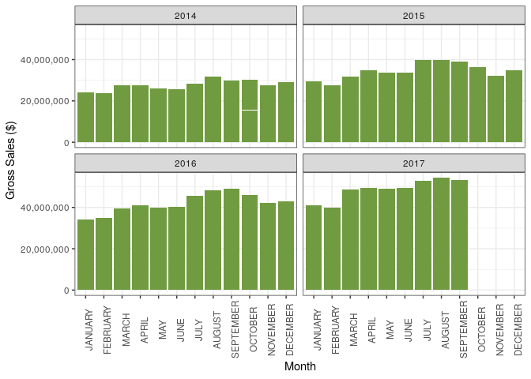

<!-- README.md is generated from README.Rmd. Please edit that file -->

<!-- You'll still need to render `README.Rmd` regularly, to keep `README.md` up-to-date. `devtools::build_readme()` is handy for this.  -->

# denverweed </a>

<!-- badges: start -->

<!-- badges: end -->

The goal of denverweed is to provide a simple dataset for analysis which
shows the different uses of wide/long form data, while giving insight
into the trials and tribulations undergone by America’s favorite
smokeable/tokeable 5-to-13 leafletted plant

## Installation

The development version of denverweed is available from
[GitHub](https://github.com/) with:

``` r
#install.packages("devtools")
#devtools::install_github("Reed-Math241/pkgGrpm")
```

## About the data

The data were collected and made available by the [City of Denver Open
Data Catalog](http://data.denvergov.org).

the denverweed package contains two datasets.

``` r
library(pkgGrpm)
data(package = 'pkgGrpm')
```

It contains the dataset `weed`, which contains 4 variables and 90
observations:

``` r
head(weed)
#>   YEAR     MONTH          GROSS_SALES_TYPE GROSS_SALES
#> 1 2017 SEPTEMBER Medical Total Gross Sales    18314027
#> 2 2017 SEPTEMBER  Retail Total Gross Sales    34950895
#> 3 2017    AUGUST Medical Total Gross Sales    19043315
#> 4 2017    AUGUST  Retail Total Gross Sales    35240979
#> 5 2017      JULY  Retail Total Gross Sales    34815762
#> 6 2017      JULY Medical Total Gross Sales    17922959
```

It also contains `weed_wider`, a pivoted, untidy version of `weed` which
may be useful for certain graphs, containing 4 variables and 45 rows

``` r
head(weed_wider)
#>   YEAR     MONTH Medical Total Gross Sales Retail Total Gross Sales
#> 1 2017 SEPTEMBER                  18314027                 34950895
#> 2 2017    AUGUST                  19043315                 35240979
#> 3 2017      JULY                  17922959                 34815762
#> 4 2017      JUNE                  17615041                 31908811
#> 5 2017       MAY                  18276904                 30671594
#> 6 2017     APRIL                  19070685                 30302993
```

## Example

gross sales by year, faceted by medical or retail

``` r
library(tidyverse)
```

``` r
ggplot(weed, aes(x = YEAR, y = GROSS_SALES)) + 
  geom_bar(stat = 'identity', fill = '#709B40') +
  facet_wrap(~GROSS_SALES_TYPE) +
  scale_y_continuous(labels = scales::comma) + 
  ylab("Gross Sales ($)") + 
  xlab("Year")+
  theme_bw()
```


gross sales by month, faceted by year

``` r

ggplot(weed, aes(x = MONTH, y = GROSS_SALES)) + 
  geom_bar(stat = 'identity', fill = '#709B40') +
  facet_wrap(~YEAR) +
  scale_y_continuous(labels = scales::comma) +
  ylab("Gross Sales ($)") + 
  xlab("Month") +
  theme_bw()+
  theme(axis.text.x = element_text(angle = 90))
```



gross sales by month, faceted by year and retail/medical

``` r
ggplot(weed, aes(x = MONTH, y = GROSS_SALES)) + 
  geom_bar(stat = 'identity', fill = '#709B40') +
  facet_grid(GROSS_SALES_TYPE ~ YEAR) +
  scale_y_continuous(labels = scales::comma) + 
  ylab("Gross Sales ($)") + 
  xlab("Month") +
  theme_bw()+
  theme(axis.text.x = element_text(angle = 90))
```


finally, a use for `weed_wider` in a scatterplot of medical vs retail
sales, by year

``` r

ggplot(weed_wider, aes(x = `Medical Total Gross Sales`, y = `Retail Total Gross Sales`, color = YEAR)) +
  geom_point() +
  scale_y_continuous(labels = scales::comma) +
   scale_x_continuous(labels = scales::comma) +
  theme_bw()
```


## Attribution

The data “Marijuana Gross Sales” ver 1.0.733, from the [City of Denver
Open Data Catalog](http://data.denvergov.org), is licensed under [CC
BY 3.0](http://creativecommons.org/licenses/by/3.0/)

## License

Data are available under a [CC
BY 3.0](http://creativecommons.org/licenses/by/3.0/) license, in
accordance with the [City of Denver Open Data Catalog terms of
use](https://www.denvergov.org/opendata/termsofuse)
